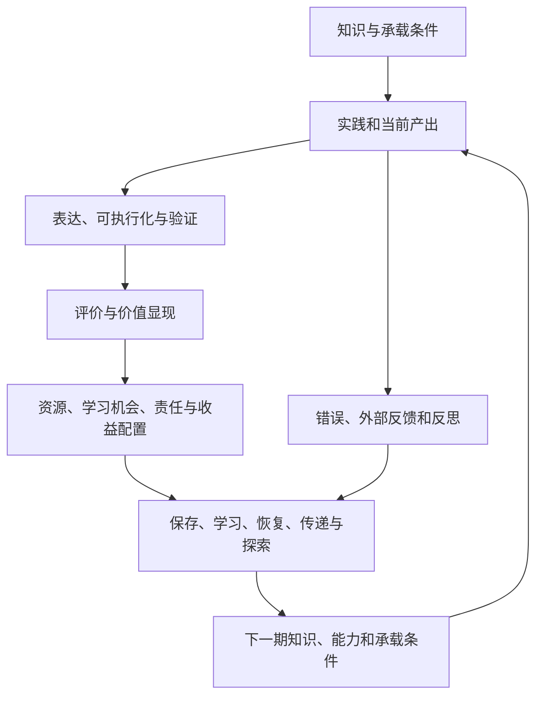

# 统一研究框架 0.5

状态：工作框架和候选机制，不是已经验证的统一定律。理论入口见 [理论地图](../theory/README.md)，历史推导见 [版本档案](../research/versions/README.md)。以下机制连接由本项目提出，不能写成文献共同证明的结果。

## 1. 中心问题

知识与无形价值由什么承载，怎样被识别、传递、配置和利用；这些过程如何影响下一轮知识、能力与价值的形成？

两条主线分别是**价值显现**与**能力再生产**。前者不等于资产货币化，后者不等于复制更多答案。统一的是问题结构，不把个人、组织、国家或所有价值类别视为同一种对象。

## 2. 三维诊断：可见、可调用、可再生产

**Visibility · Accessibility · Reproduction**  
传播表达：**看得见、调得动、长得出。**

这是对既有统一框架的表达提炼，不是新增母题、独立理论或另建一套模型。两条主线描述研究问题，三维结构帮助识别系统状态，两个循环解释可能发生的变化。简记为V、A、R时，仅为本文索引，不是公认量表或计算公式。

| 维度 | 工作定义与核心问题 | 应与什么区分 |
|---|---|---|
| V 可见性 / Visibility | 特定观察者在特定决策中，能否识别、理解，并以适当证据表达某项知识、能力或价值？可涉及表达、证据、计量和制度承认，但不要求全部完成。 | 被记录不等于被理解；有指标不等于指标有效；看见价值不等于入表或公开全部知识。 |
| A 可调用性 / Accessibility | 对特定使用者和任务，能否找到所需知识，在适当权限和条件下获取、理解、组合并可靠使用？这里的Accessibility包含实际可用性（usability），不只是检索命中、文件访问或API连通。 | 获取材料不等于吸收能力；接口存在不等于任务可靠完成；组织可调用不等于每个人均已内化。 |
| R 可再生产性 / Capacity for knowledge and capability reproduction | 在适当时间尺度内，系统是否具备保存、恢复、传递、扩展和更新知识与能力的机制，能否形成接续者和处理新问题？ | 不是文件数量、调用次数或参数规模自动增长；不是每次使用必须产出新知识；维持可靠能力也可有价值。 |

英文采用名词式 **Visibility—Accessibility—Reproduction**。`Visible → Accessible → Reproductive`保留为提出时的传播草案，不作为有先后保证的技术定义；R指知识与能力的再生产，不指单纯结果复现。

### 2.1 三维不是三个依次必过的阶段

默认并列观察V、A、R，不计算乘积、总分或等级，也不假定三维在统计上彼此独立。`V × A`只可表示联合观察，不能写成已经估计的价值函数。

以下为分析反例，不是企业实测：某项默会能力对外部观察者不易表达，却能在团队中使用和传授；某项技术已被充分描述，却因权限、接收能力或验证条件不足而无法实际应用。可调用性改善以后，学习和接续仍需另验。

因此，**可见不等于可调用，可调用不等于可再生产。** 反过来，再生产也可能帮助发现此前未被识别的知识或形成新的调用方式。箭头只代表待验证的作用，不是历史必然阶段。

### 2.2 再生产不等于数量增长，也不是资本的强制定义

“长得出”包括能力保持、接续、纠错、探索和新组合；不要求每次使用都使系统更强，也不要求保留全部过时技能。再生产过程仍需检查质量、全成本及价值后果，不能把更多错误、无效探索或重复存档视为进步。

不采用“知识成为长期资本必须依次通过三个门槛”的强断言。面向跨期效果的既有知识资源可以持续有用而不在每次调用中生成新知识；动态再生产能力是本项目另外研究的属性。沿用本库经济投资、权利、会计确认相区分的边界，见[概念](CONCEPTS.md)与[理论地图](../theory/README.md)。

对自然、文化、福祉等更广泛价值，不机械套用“可调用”或知识再生产定义；保留各自的维护、传承及评价方式。

## 3. 研究单位：知识承载系统

以一项具体能力及其依赖条件为单位，观察知识内容、人和身体实践、文件/数据/程序、工具与设备、协作关系和组织惯例，以及必要的制度与物质条件。关键依赖不自动等于本主体拥有的知识资产。

每个样本先记录任务、主体、时间、环境、质量门槛、载体、协作方式、使用与控制条件、价值对象及边界。国家是分析层级，不是拥有全部知识的单一学习者。

## 4. 两个循环及其反馈

箭头是待检验联系，不是会计恒等式或已估计的生产函数。某些联系可能不存在、反向或被抵消。反馈也可能带来锁定、遗忘、依赖加深和探索不足。

**显现与利用循环**关心已有知识能否被可靠调用；**反馈与再生产循环**关心使用是否回流为持续形成知识的条件。注意力、资源、实践机会、维护责任和收益分配是候选连接机制。

A使两个循环之间的连接成为独立的观察对象：知识怎样从“能够被识别”进入“能够完成任务”，调用是否带来实践、反馈和学习；V是否改变配置；R是否进一步形成新的知识与调用条件。这些联系分别验证，任何一条都不能由另外两维的改善代替。

## 5. 不能相互替代的五种结果

| 结果 | 应观察 | 不得替代为 |
|---|---|---|
| 资源保存 | 来源、版本、完整性、有效性和覆盖范围 | 文档数量等于能力 |
| 当前服务能力 | 固定质量和风险门槛下的合格结果、成本、范围 | 当期产出等于长期学习 |
| 人的能力形成 | 理解、错误识别、校准、保持与迁移 | 系统表现全部归于个人 |
| 系统接续与更新 | 换人、换题、换依赖后的恢复和新能力形成 | 文件保存等于接续成功 |
| 价值与分配 | 收益、公共效果、可获得性、成本及归属 | 资产估值等于全部知识价值 |

生产效率与再生产效率分别观察。不能把更多输出当更多可靠知识；也不因当前未兑现收益直接否定投资意义。保持全部旧技能不是唯一目标：淘汰旧办法、转移载体和形成新能力要分开。

## 6. 显现的不同过程

表达与编码、可执行化、证据化、计量、估值与制度确认分别记录。它们不是必经的单向流水线。示范、共同实践和人员流动可以不经过完整编码而传递知识；公共价值可以不经交易和入表而进入决策。

不可见是一种关系：对谁、在什么任务和制度中不可见，由什么障碍造成？“有形化”在本库不指所有价值变成实物，应指明究竟是表达、执行、测量还是确认。

## 7. 复制与再生产

复制载体、复现任务表现、接收者能力形成、持续形成和更新能力的条件，是四种不同结果。前一步成功不保证后一步。

再生产包括保存、恢复、传递、扩展和更新；更新包括纠错、淘汰失效规则、探索及知识新组合。既有能力下降、学习较少、能力改由系统承载、能力结构改变是不同现象。

知识容易获得不保证接收者学会；依赖工具也不能单独否定系统能力。测人的理解和测系统恢复，应采用不同检验。

## 8. 跨层级连接

个人到组织经过合作原则、分工、验证、惯例、接收端吸收和交接。组织能力不是员工知识的简单加总。

组织到国家经过职业共同体、产业网络、教育科研机构、公共基础设施及制度安排。一个企业的能力流出不等于全社会知识同量消失；总体变化不能平均赋给每个人。

不同层级的利益可能不同步。所有权、控制、使用机会、责任和收益分配分别观察，不预设组织捕获更多知识等于所有人共同进步。

## 9. 计量与价值边界

资本形成、法律权利、国民核算与企业会计确认不同；投资流量、资产存量和服务流量不能直接相加。能力形成、既有价值被识别、估值重估、统计重分类分别记录。

同一未来收益不得在人的能力、组织资本和知识产权估值中重复完整计入。自然、文化、福祉及不可货币化价值保留自己的指标；公共/私人/共有、分配、有限替代性和控制边界不得被总值掩盖。

“国家价值总量”仅作为候选构念，本库当前不计算总分、排行榜或金额。个人测验结果不得乘人口折算为国家知识资本。

## 10. 反证与停止条件

框架必须容纳：AI直接协作已改善学习；专门知识包没有增量；反馈成本超过收益；资源充分保存后能力确可低成本接续；所谓能力损失来自任务变化；估值变化与能力变化不同步。

反证应改变命题边界、数据设计与下一版。没有增量时，不为维护框架而机械增加步骤。

## 11. 当前验证范围

首个样本只涉及专业证据判断的一部分，见 [试用协议](../experiments/evidence-judgment/05_pilot_protocol.md)。已交付可检验载体，但尚无人员结果、有效测验或能力增长证据。

组织接续、价值显现—配置反馈均需独立研究。当前命题与反证条件见 [HYPOTHESES](../research/HYPOTHESES.md)。

## 12. 组织层研究入口：民营500强与企业知识系统

[民营500强组织层研究接口](../research/organization/private-enterprise-500.md)将该研究线接回统一框架，不另建“500强知识模型”。其用途是联合观察外部统计如何识别知识性投入、企业内部如何组织调用，以及是否存在持续接续与更新机制。

华为、美的、吉利、腾讯按本次研究输入列为候选企业追踪对象，不据此声称四家公司均有完整固定面板或已显示三维增长。近三十年的窗口、起止年份、发布年与经营数据年、主体边界和具体证据仍需逐项核验。轮换榜单不是同一批企业的连续面板。

本轮只完成概念与研究入口的整合，没有导入500强年度数据、企业原始材料或新增因果证据。当前状态见[0.5修订记录](../research/versions/v0.5.md)。
